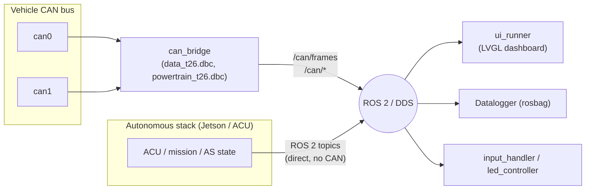

<p align="center">
  
</p>

# LART DataStation w/ ROS2

Formula Student dashboard workspace for Raspberry Pi 5 + dual CAN (Waveshare 2-CH CAN HAT+).

## Architecture

The DataStation sits between the car's CAN bus and the autonomous stack, and
exposes everything to the driver through the LVGL dashboard:

- **CAN in** — `can0`/`can1` carry `data_t26.dbc` and `powertrain_t26.dbc`
  frames (speed, temps, pressures, HV/LV, inverter/motor telemetry). The
  `can_bridge` decodes these directly off the wire and republishes them as
  ROS 2 topics (`/can/frames`, `/can/*`).
- **Autonomous in** — the Jetson/ACU stack does **not** go through the CAN
  bridge. It publishes its own ROS 2 topics over DDS (mission state, ACU
  state, AS state, emergency cause, SLAM/lap info), and the DataStation
  simply **subscribes** to them.
- **Dashboard out** — `ui_runner` subscribes to both the CAN-derived topics
  and the autonomous topics and renders everything on the cockpit UI
  (Driver View, Autonomous, and the paged Debug/Debug-Autonomous screens).



## Interface preview


The driver view keeps speed, readiness, temperatures, voltage, SOC, lap data and
pedal status visible with high contrast. Engineering-only signals remain on the
debug pages and in the recorded telemetry.

## Project structure

```
.
├── src/
│   ├── lart_bringup/     launch files + shared config (car.launch.py, sim.launch.py, config/rpi_config.yaml)
│   ├── lart_msgs/        custom ROS 2 messages (CanFrame, ButtonEvent, EncoderDelta, DashboardState)
│   ├── sim/              mock_can.py — simulated vehicle values for home testing
│   ├── input_handler/    GPIO buttons + encoders (sim_mode skips hardware)
│   └── led_controller/   WS2812 relative-current bar (safe no-op without NeoPixel libs)
├── LART_Car_Dashboard_v1/
│   └── src/ui/           LVGL C++ dashboard (ui_runner, can_bridge, generated DBC API)
├── dbc_signals/          DBC source files (data_t26.dbc, powertrain_t26.dbc, autonomous_t26.dbc)
├── scripts/              pull_arm64_build.sh — pulls the CI-built arm64 release onto the Pi
├── .github/workflows/    build-arm64.yml — CI build + release of the ROS2 workspace + ui_runner
├── imgs/                 README assets (logo, interface screenshot)
├── context.md            full architecture/dev-conventions reference for collaborators & LLMs
└── setup.md              archived legacy setup notes (credentials, old HAT overlay, loopback tests)
```

## What does what

- `lart_bringup`: launch + shared config (`car.launch.py`, `sim.launch.py`, `config/rpi_config.yaml`).
- `lart_msgs`: custom ROS 2 messages (`CanFrame`, `ButtonEvent`, `EncoderDelta`, `DashboardState`).
- `lart_bringup/can_bridge.py`: real car CAN reader (`can0/can1`) and ROS publisher.
- `sim/mock_can.py`: simulated vehicle values for home testing.
- `LART_Car_Dashboard_v1/src/ui`: LVGL C++ dashboard interface (production `ui_runner` application).
- `input_handler`: GPIO buttons + encoders (`sim_mode` skips hardware).
- `led_controller`: WS2812 relative-current bar (safe no-op on machines without NeoPixel libs).

## Data flow

- CAN CH1/CH2 -> `can_bridge` (car) or `mock_can` (home).
- Topics published: `/can/frames`, `/vehicle/rpm`, `/vehicle/dashboard_state` and dynamic `/can/*` topics.
- Jetson/ACU autonomous stack publishes its own ROS 2 topics directly (no CAN involved); `ui_runner` subscribes to them.
- `ui_runner` (LVGL dashboard) consumes the CAN topics, autonomous topics, and state topics to render the cockpit UI.
- `led_controller` consumes inverter relative-current requests and drives the LED strip.
- `input_handler` publishes `/input/buttons` and `/input/encoders`.

## Build

Compiled output (the ROS2 workspace and the `ui_runner` dashboard binary) is
built by GitHub Actions (`.github/workflows/build-arm64.yml`) on every push to
`master`. Every successful build is retained as a GitHub Release tagged
`arm64-<full-commit-sha>`, while `latest-arm64` continues to point to the most
recent build. The Pi pulls the latest release instead of compiling locally:

**One-time prerequisite** (run once on a fresh/reimaged Pi):
```bash
sudo apt install libsdl2-2.0-0
```
This installs the SDL2 runtime library needed by the `ui_runner` binary.

Then pull and run the build:
```bash
cd ~/GIT/lart_dashboard_ws
git pull
pip install -r requirements.txt --break-system-packages
./scripts/pull_arm64_build.sh
source install/setup.bash
```

To use an older build, open the repository's GitHub Releases page, select the
`arm64-<full-commit-sha>` release for the desired commit, and download its
`lart-dashboard-arm64.tar.gz` asset. Fast builds are retained in the same way
under `faster-arm64-<full-commit-sha>` tags.

To build locally instead (e.g. while developing on a non-arm64 machine, or if
CI is unavailable), use the original workflow:

```bash
cd ~/GIT/lart_dashboard_ws
source ~/ros2_jazzy/install/local_setup.bash
pip install -r requirements.txt --break-system-packages
colcon build --symlink-install
source install/setup.bash
```

## Run simulation

```bash
source ~/ros2_jazzy/install/local_setup.bash
source ~/GIT/lart_dashboard_ws/install/setup.bash
ros2 launch lart_bringup sim.launch.py
```

## Run on the car (real CAN + GPIO + LEDs)

1) Bring CAN interfaces up:

```bash
sudo ip link set can0 up type can bitrate 1000000
sudo ip link set can1 up type can bitrate 500000
```

2) Launch:

```bash
source ~/ros2_jazzy/install/local_setup.bash
source ~/GIT/lart_dashboard_ws/install/setup.bash
ros2 launch lart_bringup car.launch.py
```

For DBC changes, follow the [DBC update guide](docs/DBC-Update-Guide.md) to validate, regenerate, rebuild, and update consumers.

## Python CAN admin panel

Build once after updating the workspace, then open the desktop panel:

```bash
source /opt/ros/jazzy/setup.bash
colcon build --symlink-install --packages-select sim lart_bringup
source install/setup.bash
export ROS_DOMAIN_ID="${ROS_DOMAIN_ID:-42}"
ros2 run sim admin_panel
```

Tkinter is required (`sudo apt install python3-tk` if missing). The panel uses
existing virtual CAN interfaces; set them up once with
`sudo ./scripts/setup_vcan_interfaces.sh vcan_data vcan_pwt vcan_auto`.
Start the dashboard separately with the same ROS domain.
`LART_Car_Dashboard_v1/start_local.sh` opens it minimized in a normal window
and leaves simulation startup to the Python panel. Opening the panel starts or
attaches to the simulation stack automatically.

- **Start / attach** starts `dbc_sim.launch.py` or connects to its existing nodes.
  **Pause/Resume** controls one bus or all buses. **Stop owned stack** only stops
  a launch started by this panel.
- Select a signal, choose **Auto**, **Fixed**, **Sweep**, or **Random**, and apply.
  Values and min/max use DBC physical units. Sweep duration is a complete
  minimum → maximum → minimum cycle. Discrete choices and multiplexer branches
  support fixed/random valid values. Inactive branch values appear when selected
  by the multiplexer. Blank message timing restores the bus default.
- The scenario controls reproduce the shell test menu's speed sequences, with
  an editable step interval (500 ms by default). Speed is converted into inverter
  ERPM using the dashboard's existing gearing and tire dimensions; it does not
  publish the unused `/vehicle/speed_kph` topic.
- **CAN simulation** tests the full simulator → CAN bridge → current ROS topics
  path. **Direct ROS** edits current aggregated `/data/*`, `/pwt/*`, `/can/*`
  messages, preserving other fields. An initial message is required. Affected
  simulator buses pause during direct tests; **Cancel / end test** restores
  their prior state. CAN scenarios restore prior controls on completion/cancel.
- Mission selectors and **HV ON sequence** use the existing simulator parameters.
  Screen buttons select the three production screens. **Record / stop bag** uses
  `BAG_DIR` (default `~/bags`) and `BAG_RECORD_REGEX` from the shell test menu.
  Closing the panel ends temporary tests and finalizes recordings it started.

Live simulator parameters are `enabled`, `publish_hz`, `signal_controls`, and
`message_intervals_ms`. The latter two are JSON strings, for example:

```json
{"INV1_ERPM_DUTY_VOLTAGE": {"INV1_Actual_ERPM": {"mode": "fixed", "value": 20000}}}
```

```json
{"INV1_ERPM_DUTY_VOLTAGE": 50}
```

Controls remain in memory for the simulator session. Existing simulators must
be restarted after rebuilding to expose the new parameters. If a single DBC
launch is used, set up its `vcan0` interface instead.
