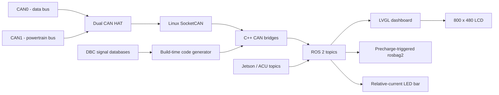
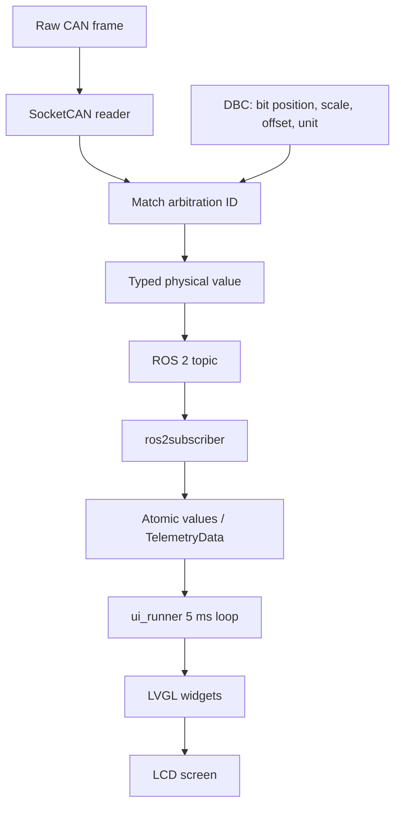
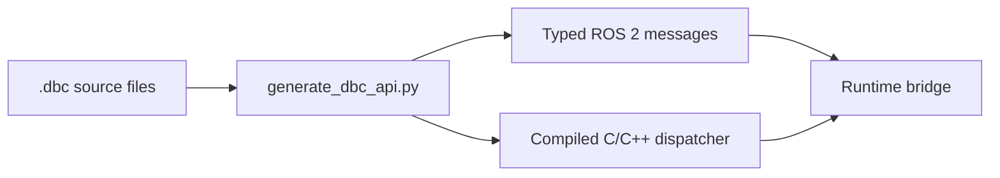
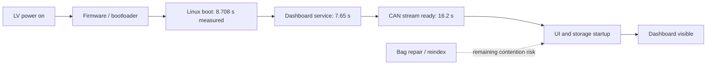

# LART Data Station - Formula Student Statics

**Car:** #42 - FS Portugal, Polytechnic of Leiria  
**Platform:** Raspberry Pi 5, dual CAN interface and 800 x 480 cockpit display  
**Revision:** 29 September 2026

This document is structured for a Formula Student statics presentation. It combines the attached `Data-Station.pdf`, the current repository and earlier project investigations. The attached PDF is treated as a design reference: proposed tests are marked as targets until a measured result exists.

# PROBLEM

## Problem & Solution Possibilities

The car generates important information in several independent electronic systems: the powertrain, AMS/BMS, inverters, VCU, autonomous stack, sensors and PDM. Without a central data station, that information is difficult to interpret during driving and difficult to analyse after a run.

The engineering problem is therefore not only to display a speed value. The system must:

- receive data from more than one CAN network;
- convert raw CAN bytes into meaningful physical values;
- show the most important values clearly to the driver;
- preserve detailed data for engineers;
- remain usable when the car is tested without the complete vehicle;
- start quickly and recover predictably after power cycles.

### Possible solutions considered

| Possibility | Advantage | Limitation |
|---|---|---|
| A separate microcontroller display | Very low boot time and deterministic control | Limited graphics, storage and engineering tooling; duplicates logic already present in vehicle controllers. |
| A laptop in the car | High processing power and a large screen | Poor packaging, higher power demand and lower resistance to vibration and power cycling. |
| A Raspberry Pi with a Linux dashboard | Good graphics, storage, connectivity and ROS 2 support | Requires careful startup, thermal and power management. |
| A single application directly connected to CAN | Small software stack | Couples acquisition, display, recording and future tools; harder to simulate and extend. |

### Selected solution

The selected solution is a Raspberry Pi 5 Data Station with a dual CAN HAT, compiled C++ CAN bridges, generated DBC decoding, ROS 2 topics, an LVGL dashboard and precharge-triggered rosbag2 recording.

The Data Station observes and presents vehicle state. It does not replace the VCU, AMS/BMS, inverter or autonomous controller. Those systems remain responsible for vehicle control if the display computer fails.

### System overview

# PROCESS

## What?

The Data Station is the central acquisition, processing, visualisation and logging computer for the Formula Student car.

### Hardware to be designed and integrated

| Element | Current choice | Function |
|---|---|---|
| Central computer | Raspberry Pi 5 | Runs acquisition, ROS 2, display and logging. |
| CAN interface | Waveshare 2-CH CAN HAT+ | Provides two independent CAN transceivers. |
| Display | 7-inch 800 x 480 LCD | Presents driver and autonomous information. |
| Power | LV system through the PDM at 5 V | Supplies the Data Station without connecting it directly to the traction battery. |
| Peripheral indicator | 16-pixel addressable LED bar | Shows average inverter drive or regenerative-current demand. |

The current repository configuration expects `can0` to be the data bus at 1,000,000 bit/s and `can1` to be the powertrain bus at 500,000 bit/s. The attached PDF labels the buses differently in one diagram, so the physical harness labels must be checked before the final statics presentation.

### Software to be designed and integrated

The deployed car path is the C++/LVGL path under `LART_Car_Dashboard_v1/`. A separate Python ROS 2 path and a virtual-CAN simulation path are retained for development and bench work.

### Production and development paths

| Path | Implementation | Purpose |
|---|---|---|
| Production | C++ `can_bridge` + C++ `ui_runner` + LVGL | Real vehicle deployment through `autostart_dashboard.sh`. |
| Native alternative | Python `lart_bringup` nodes and optional pygame UI | Bench/hardware experiments and an alternative launch path. |
| Desktop simulation | Docker, virtual CAN and mock/DBC simulator | Development without the car or CAN HAT. |

For statics, the production path should be presented as the deployed architecture. The pygame dashboard and `ros2 launch lart_bringup car.launch.py` are not the current boot path.

## Why?

### Why Raspberry Pi 5?

The Raspberry Pi 5 can combine graphics, Linux storage, ROS 2, CAN connectivity and engineering tools in one compact unit. The car already uses dedicated microcontrollers for real-time control, so the Data Station is better treated as a high-level telemetry and interface computer rather than another control ECU.

### Why two CAN channels?

The vehicle has separate networks with different traffic and bit-rate requirements. Two physical channels prevent the software from mixing bus timing and signal databases. Each bridge loads the DBC file that belongs to its bus.

### Why an 800 x 480 display?

The display has 384,000 pixels. A Full HD display has 2,073,600 pixels, about 5.4 times more. The selected resolution provides enough space for large, readable cockpit values while leaving more processing capacity for data acquisition and logging.

The driver view prioritises speed, ready state, temperatures, voltage, SOC, pedals and lap information. Debug screens expose more signals to engineers without overloading the driver during a run.

### Why ROS 2?

ROS 2 provides a typed publish/subscribe interface between acquisition, display, recording, simulation and auxiliary tools. It also allows the same telemetry to be inspected or recorded without coupling the UI directly to the CAN socket.

The real car uses `ROS_DOMAIN_ID=42`; desktop and native launch defaults use `0`. The domain must match when components need to discover one another.

### Why generated DBC decoding?

The `.dbc` files are the signal source of truth. They define signal position, length, scale, offset and unit. `generate_dbc_api.py` converts those definitions into C/C++ structures, ROS 2 message types and dispatch code.

This moves interpretation work to the build phase. The runtime path has fewer dependencies and no need to parse a DBC while the car is running. The trade-off is that a DBC change requires regeneration and a rebuild.

Generated files such as `dbc_api.cpp`, `dbc_api.h` and `generated/can_bridge_impl.hpp` must not be edited manually. The DBC files or the generator are the correct place to make changes.

### Why C++ for the production path?

C++ gives the deployed bridge and UI direct SocketCAN access, low runtime overhead, predictable memory behaviour, and a pre-built native executable. Python is still useful for simulation, configuration and auxiliary nodes because those tools benefit more from quick iteration than from a compiled hot path.

### Why the LED SPI change?

The original NeoPixel/Pio route required `/dev/pio0`, which was absent in the deployed Ubuntu kernel. Changing Python packages could not create a missing kernel device. The lower-risk solution was to use the SPI NeoPixel driver, move the LED data wire to SPI0 MOSI on GPIO 10, and keep the CAN HAT on SPI1.

The bar uses the average relative-current request of both inverters. Positive demand fills outwards in the drive colour, negative demand fills outwards in the regen colour, and shutdown turns the bar off.

### Why precharge-triggered logging?

Recording starts when `/pwt/start_precharge` reaches `0.5`, remains active for a 30-second grace period after it drops, and finalises the session when possible. This captures a vehicle session without filling the storage continuously.

The configured recording expression includes decoded `/data`, `/pwt`, `/can` and `/imu` topics while excluding raw `/can/frames`. One continuous file per session is used by default to reduce the risk of fragmented metadata after an unexpected power loss.

### Boot-time improvement process

The project initially showed an observed boot-to-display time of about one minute, with a later observation of about 37 seconds from LV power-on to the dashboard appearing. The investigation measured each stage before changing the design.

The changes were:

1. configured firmware waits were set to zero and verified;
2. normal boots stopped compiling the UI;
3. `autostart_dashboard.sh` launches existing `ui_runner` and CAN bridge binaries directly;
4. timestamped boot logs separate firmware, Linux, service, CAN and UI delays;
5. ARM64 build artifacts allow deployment without compiling the complete workspace on the car.

The measured Linux boot time is not the same event as first visible dashboard frame time. Removing the Ubuntu GUI was considered, but the evidence pointed to application/storage startup rather than the Linux GUI as the main remaining delay. The current launcher still starts `bag_recorder` before the UI, and it can reindex incomplete bags, so that is an identified improvement rather than a completed fix.

### Build and deployment efficiency

The Pi is also constrained during software builds. The repository therefore provides a fast development build that skips the rarely changing `lart_msgs` package, limits parallel compilation to avoid memory pressure, and uses `ccache` when available. A complete build remains available when DBC files or message definitions change.

The ARM64 workflow caches build inputs and publishes a versioned `arm64-<commit>` artifact, making deployment traceable to a source revision.

# RESULTS

## Type of analysis

| Analysis type | What was analysed | Status |
|---|---|---|
| Design phase | Hardware selection, display layout, CAN partitioning and software architecture | Implemented design direction. |
| Software architecture | CAN-to-DBC-to-ROS 2-to-LVGL data path | Implemented in the production path. |
| Build/deployment analysis | Pi boot stages, native build path and ARM64 artifacts | Boot stages measured; deployment workflow implemented. |
| Bench/simulation analysis | Virtual CAN, mock data, DBC simulation and unit tests | Available in the repository. |
| Vehicle validation | Latency, thermal, CAN load, EMI, legibility and vibration/storage tests | Planned targets from the attached PDF unless a separate test record exists. |

## Analysis Results

### Measured results

| Result | Value | Interpretation |
|---|---:|---|
| Linux kernel plus userspace boot | **8.708 s** | The OS baseline is much shorter than the original perceived boot-to-display time. |
| Dashboard service start | **7.65 s** | The service is requested early in userspace. |
| Dashboard launcher active | **7.78 s** | The launcher itself is not waiting one minute before starting. |
| CAN stream ready | **16.2 s** | CAN infrastructure becomes available early in the boot sequence. |
| GPU/HDMI/KMS framebuffer ready | approximately **5.07 s** | Display hardware initialisation is not the only cause of the long visible delay. |
| Repository test snapshot | **55 passed, 4 failed** | Three LED expectations are stale; one test expects a removed workflow. Do not claim a clean suite until reconciled. |

### Pros

- Centralises live telemetry, display and logging in one compact computer.
- Keeps vehicle control functions in their dedicated controllers.
- Uses DBC files as a single source of truth for signal interpretation.
- Uses ROS 2 to separate acquisition, UI, recording, simulation and auxiliary tools.
- Uses generated C++ code in the runtime path instead of parsing DBC files while driving.
- Provides a driver-focused screen and separate engineering/debug screens.
- Supports virtual CAN and simulation, reducing dependence on the complete vehicle.
- Uses pre-built ARM64 binaries on normal deployments, avoiding a full boot-time compile.
- Records sessions around precharge instead of continuously consuming storage.

### Cons

- The Raspberry Pi is not a hard real-time safety controller.
- Linux, ROS 2 and SDL2 introduce more software layers than a dedicated microcontroller display.
- The production C++ path and the alternative Python path can drift if both are changed independently.
- The DBC-to-code workflow requires regeneration and a rebuild after signal changes.
- The current launcher can still spend time repairing incomplete bags before the UI is fully ready.
- Formal vehicle evidence for latency, thermal margin, EMI, sunlight legibility and vibration/storage is still required.
- The repository test suite currently contains stale expectations and a stale workflow test.

### Improvements Suggested

1. Move bag repair and recorder initialisation out of the critical UI startup path, or run repair after the first frame is visible.
2. Add a direct timestamp from CAN reception to widget update and record the measured latency distribution, not only the target of 50 ms.
3. Add a thermal test at representative CPU and CAN load and store the result with the run artifact.
4. Perform a sustained high-load CAN test and count received, decoded, rejected and lost frames.
5. Reconcile the three LED test colour expectations with the current red-drive/blue-regen implementation.

8. Remove the legacy plaintext credentials from `setup.md` and rotate them if they were ever used.

### Statics answers

**Why did you choose a Raspberry Pi instead of a microcontroller?**  
The car already has microcontrollers for real-time control. The Data Station needs graphics, storage, ROS 2 tooling and post-run analysis, so a Linux SBC is the better fit for this non-safety-critical interface and telemetry role.

**What exactly reduced boot time?**  
The boot stages were measured first. Firmware waits were set to zero, the UI stopped compiling during normal boot, and pre-built ARM64 binaries were launched directly. Linux boot was measured at 8.708 seconds; that number is kept separate from the longer screen-visible time caused by application and storage startup.

**What happens if an unknown CAN frame arrives?**  
Only frames described by the selected DBC are decoded. Unknown frames do not become random dashboard values and should not crash the bridge.

**Why not show every signal on the driver screen?**  
The driver needs fast recognition, not maximum information density. Important values are large and high contrast; detailed data remains available in debug pages and recorded telemetry.

**What is still to prove?**  
The remaining evidence is vehicle-level: CAN-to-screen latency, thermal margin, behaviour under bus load, EMI robustness, display legibility and storage integrity under vibration.

### Files to show the judges

- Production startup: `LART_Car_Dashboard_v1/autostart_dashboard.sh`
- Production UI loop: `LART_Car_Dashboard_v1/src/ui/ui_runner.cpp`
- C++ SocketCAN bridge: `LART_Car_Dashboard_v1/src/ui/can_bridge.cpp`
- DBC generator: `LART_Car_Dashboard_v1/src/ui/generate_dbc_api.py`
- DBC source: `dbc_signals/`
- Recorder: `src/lart_bringup/lart_bringup/bag_recorder.py`
- LED controller: `src/led_controller/led_controller/led_node.py`
- Runtime parameters: `src/lart_bringup/config/rpi_config.yaml`
- Full project context: `context.md`

